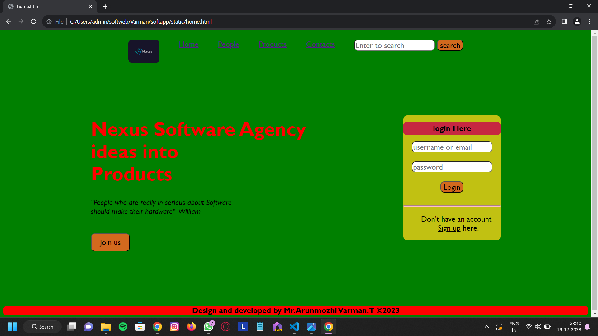
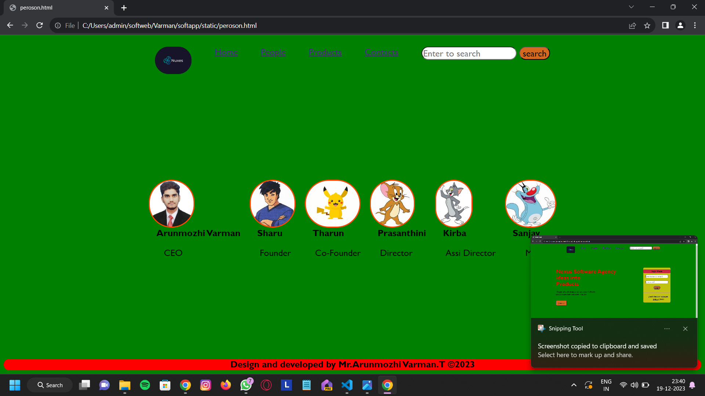
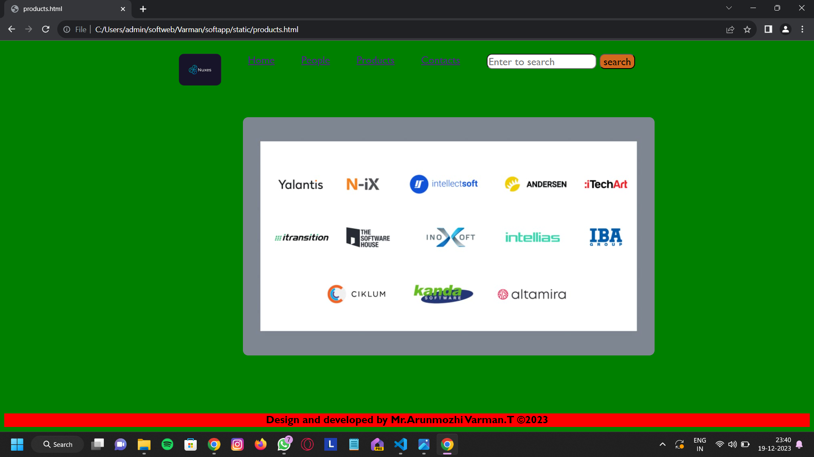

# Ex.07 Software Product Company Website
## Date: 19.12.2023

## AIM:
To develop a static company website to display the softwares and services provided by the company.

## DESIGN STEPS:

### Step 1:
Requirement collection.

### Step 2:
Creating the layout using HTML and CSS.

### Step 3:
Updating the sample content.

### Step 4:
Choose the appropriate style and color scheme.

### Step 5:
Validate the layout in various browsers.

### Step 6:
Validate the HTML code.

### Step 7:
Publish the website in the given URL.

## PROGRAM:
```
<html>
    <head>
        <link rel="stylesheet" href="stylehome.css">

    </head>
    <body>
        <div class="nav">
            <div class="logo"></div>
            <li><a href="./home.html">Home</a></li>
            <li><a href="peroson.html">People</a></li>
            <li><a href="./products.html">Products</a></li>
            <li><a href="./contact.html">Contacts</a></li>
        <div>
            <input type="text" placeholder="Enter to search" >
            <button type="submit" class="button" >search</button>
            
        </div>
    </div>
    <div class="home">
        <div class="head">
        <h1>Nexus Software Agency </br>ideas into </br>Products</h1>
        <p class="quote">"People who are really in serious about Software </br>should make their hardware"- William </p>
        <button class="join">Join us</button>
    </div>
    <div class="login">
        <h2 class="log">login Here</h2> 
        <div class="logbox">
        <input type="text" placeholder="username or email" class="but"></input></br></br>
        <input type="text"  placeholder="password" class="but"> </input></br></br>
        <button type="submit" class="bute">Login</button></br></br>
        <hr id="loge">
        </div>
        <p> &nbsp;&nbsp;&nbsp;&nbsp;Don't have an account </br>&nbsp;&nbsp;&nbsp;&nbsp;&nbsp;&nbsp;<u>Sign up</u> here.</p>

    </div>
    </div>
    <footer>
        <div  class="colored-line">
            <h5>Design and developed by Mr.Arunmozhi Varman.T &copy;2023</h5>
        </div>
    </footer>

    
    
    </body>
</html>

.nav{
    display: flex;
    justify-content:center;
    gap: 50px;
    margin-top: 25px ;  
}

li{
    list-style: none;
    font-weight: 100px;
    
}

body{
    background-color: green;

  }

*{
    font-size:20px;
    font-family:'Gill Sans', 'Gill Sans MT', Calibri, 'Trebuchet MS', sans-serif;
    border-radius: 10px;
.home{
    margin: 0;
    display: flex;
    align-items: center;
    justify-content: center;
    height: 80vh;
    gap:250px;

}
.login{
    background-color: #c1c112;
    text-align: center;
    width:250px;

}
.log{
    padding: 5px;
    background-color: rgb(198, 39, 65);
    border-radius: 8px;
}
.but{
    border-radius: 10px;
    background-color:;
}
.bute{
    border-radius: 10px;
    background-color: chocolate;

}
#loge{
    border-color: pink;
    border-width: 2px;
}
h1{
    color: red;
    font-size: 50px;
}
.join{
    border-radius: 10px;
    background-color:chocolate;
    padding:10px;
    width: 100px ;
    margin-top: 25px;
}
.quote{
    font-style: oblique;
    font-style: italic;
}
.colored-line {
    width: 100%; 
    height: 25px; 
    background-color:red;
    text-align: center;
    
  }
  .button{
    background-color: chocolate;
  }

  <html>
    <head>
        <link rel="stylesheet" href="./personstyle.css">

    </head>
    <body>
        <div class="nav">
            <div class="logo"></div>
            <li><a href="./home.html">Home</a></li>
            <li><a href="peroson.html">People</a></li>
            <li><a href="./products.html">Products</a></li>
            <li><a href="./contact.html">Contacts</a></li>
        <div>
            <input type="text" placeholder="Enter to search" >
            <button type="submit" class="button" >search</button>
            
        </div>
    </div>
    <div class="person">
        <li> </br><span> &nbsp;&nbsp;&nbsp;Arunmozhi Varman</span><p>&nbsp;&nbsp;&nbsp;&nbsp;&nbsp;&nbsp;CEO</p></li>
        <li> </br><span>&nbsp;&nbsp;&nbsp;Sharu</span><P>&nbsp;&nbsp;&nbsp;&nbsp;Founder</P></li>
        <li> </br><span>&nbsp;&nbsp;&nbsp;Tharun</span><p>&nbsp;&nbsp;&nbsp;&nbsp;Co-Founder</li>
        <li> </br><span>&nbsp;&nbsp;&nbsp;Prasanthini</span><p>&nbsp;&nbsp;&nbsp;&nbsp;Director</p></li>
        <li> </br><span>&nbsp;&nbsp;&nbsp;Kirba</span><p>&nbsp;&nbsp;&nbsp;&nbsp;Assi Director</p></li>
        <li> </br><span>&nbsp;&nbsp;&nbsp;Sanjay</span><P>&nbsp;&nbsp;&nbsp;&nbsp;&nbsp;&nbsp;&nbsp;&nbsp;MD</P></li>
    </div>
    <footer>
    <div  class="colored-line">
        <h5>Design and developed by Mr.Arunmozhi Varman.T &copy;2023</h5>
    </div>
</footer>
    
    
    </body>
</html>

.nav{
    display: flex;
    justify-content:center;
    gap: 50px;
    margin-top: 25px ;  
}

li{
    list-style: none;
    font-weight: 100px;
    
}
.person{
    display: flex;
    margin-top: 230px;
    justify-content: center;
    gap: 20px;
}
.bod{
    height: 100px;
    border: 3px solid orangered;

}
*{
    font-size:20px;
    font-family:'Gill Sans', 'Gill Sans MT', Calibri, 'Trebuchet MS', sans-serif;
    border-radius: 60px;
}
span{
    font-size: 20px;
    font-weight: 1000;
    text-indent: 20px;
    
}
.colored-line {
    width: 100%; 
    height: 25px; 
    background-color:red;
    text-align: center;
    margin-top: 200px;
  }
  body{
    background-color:green; 

  }
  .button{
        background-color: chocolate;
      
  }

  <html>
    <head>
        <link rel="stylesheet" href="styleproduct.css">

    </head>
    <body>
        <div class="nav">
            <div class="logo"></div>
            <li><a href="./home.html">Home</a></li>
            <li><a href="peroson.html">People</a></li>
            <li><a href="./products.html">Products</a></li>
            <li><a href="./contact.html">Contacts</a></li>
        <div>
            <input type="text" placeholder="Enter to search" >
            <button type="submit" class="button" >search</button>
            
        </div>
    </div>
    <div>
        
    </div>
    <footer>
        <div  class="colored-line">
            <h5>Design and developed by Mr.Arunmozhi Varman.T &copy;2023</h5>
        </div>
    </footer>
    
    
    </body>
</html>

.nav{
    display: flex;
    justify-content:center;
    gap: 50px;
    margin-top: 25px ;  
}

li{
    list-style: none;
    font-weight: 100px;
    
}


*{
    font-size:20px;
    font-family:'Gill Sans', 'Gill Sans MT', Calibri, 'Trebuchet MS', sans-serif;
    border-radius: 10px;
}

  body{
    background-color:green;

  }
.imge{
    border-radius: 10px;
    height: 450;
    margin-top: 60px;
    margin-left: 450px;
}
.colored-line {
    width: 100%; 
    height: 25px; 
    background-color:red;
    text-align: center;
    margin-top: 110px;
    border-radius: 0;
  }

  .contact{
    display: flex;
    justify-content:center;
    align-items: center;
    height: 80vh;
    gap: 300px;

  }
  span{
    font-weight: 1000px;
  }
  .info{
    background-color:pink;
    padding: 10px;
    border: 3px solid orange;
    border-radius: 30px;
    
  }
  .detail{
    background-color: pink;
    padding: 10px;
    border: 3px solid orange;
    border-radius: 30px;

  }
  .comment{
    padding:50px; }
  .submit{
    background-color: chocolate;
  }
  .button{
    background-color: chocolate;
  }
  

 <html>
    <head>
        <link rel="stylesheet" href="stylecontact.css">

    </head>
    <body>
        <div class="nav">
            <div class="logo"></div>
            <li><a href="./home.html">Home</a></li>
            <li><a href="peroson.html">People</a></li>
            <li><a href="./products.html">Products</a></li>
            <li><a href="./contact.html">Contacts</a></li>
        <div>
            <input type="text" placeholder="Enter to search" class="button">
            <button type="submit" class="submit" >search</button>
                
    </div>
</div>
<div class="contact">
    <div class="detail">
    <h1> Contact Us</h1>
    <br>
    <input type="text" placeholder="Your Name"></inupt> 
    <br><br>
    <input type="text" placeholder="Your Email"></inupt>
    <br><br>
    <input type="text" placeholder="Your Message" class="comment"></inupt>
    <br><br>
    <button type="submit" class="submit">Submit</button>

</div>
<div class="info">
    <h1>Contact information</h1>
    <br>
    <span><strong>Address:</strong></span>    Morappur,dharmapuri,635305</p>
    <span><strong>Email:</strong></span>    arunfy69@gmail.com</p>
    <span><strong>Phone: </strong></span> 033-4875327</p>

</div>
</div>
<footer>
    <div  class="colored-line">
        <h5>Design and developed by Mr.Arunmozhi Varman.T &copy;2023</h5>
    </div>
</footer>
    
  
    
    
    </body>
</html>

.contact{
    display: flex;
    justify-content:center;
    align-items: center;
    height: 80vh;
    gap: 300px;

  }
  span{
    font-weight: 1000px;
  }
  .info{
    background-color:rgb(221, 17, 27);
    padding: 10px;
    border: 3px solid orange;
    border-radius: 30px;
    text-align: center;
    
  }
  .detail{
    background-color: rgb(213, 20, 52);
    padding: 10px;
    border: 3px solid orange;
    border-radius: 30px;
    

  }
  .comment{
    padding:50px; }
  .submit{
    background-color: chocolate;
  }
  body{
    background-color:green;

  }
  
*{
    font-size:20px;
    font-family:'Gill Sans', 'Gill Sans MT', Calibri, 'Trebuchet MS', sans-serif;
    border-radius: 10px;
}
li{
    list-style: none;
    font-weight: 100px;
    
}
.nav{
    display: flex;
    justify-content:center;
    gap: 50px;
    margin-top: 25px ;  
}
h1{
    font-size: 1.5rem;
  }
  .colored-line {
    width: 100%; 
    height: 25px; 
    background-color:red;
    text-align: center;
    margin-top: 35px;
  }
```


## Output





## RESULT:
The program for designing software company website using HTML and CSS is completed successfully.
